# Invoice Data Model — ER Diagram

> Each row uses Mermaid syntax: `Type  Name  [Key]  [Note]`.
> The Note also tags the field's kind: **enum**, **FK**, **free string**, **derived**, **snapshot**, **reference**, etc.

```mermaid
erDiagram
    %% ─── Reference tables ───
    CURRENCY {
        string id PK
        string code "free string, unique, e.g. NPR"
        string name "free string, e.g. Nepalese Rupee"
        string symbol "free string, e.g. Rs"
        int decimals "default 2"
    }

    COUNTRY {
        string id PK
        string currencyId FK "to Currency.id, default currency"
        string name "free string, e.g. Nepal"
        string iso2 "unique, e.g. NP"
        string iso3 "e.g. NPL"
        int callingCode "e.g. 977"
        string flagUrl "nullable"
    }

    %% ─── Shared reusable records ───
    ADDRESS {
        string id PK
        string countryId FK "to Country.id"
        string province "free string, Nepal: Bagmati"
        string district "nullable, free string"
        string city "free string, Nepal: Municipality"
        string ward "nullable, free string"
        string locality "nullable, free string"
        string streetAddress "nullable, free string"
        string line2 "nullable, free string"
        string landmark "nullable, free string"
        string postalCode "nullable, free string"
        decimal latitude "nullable"
        decimal longitude "nullable"
        datetime createdAt "default now()"
        datetime updatedAt "auto"
    }

    CONTACT_METHOD {
        string id PK
        string countryId FK "nullable, to Country.id, for phone numbers"
        string type "enum ContactType"
        string value "free string"
        string label "nullable, free string, e.g. Office"
        boolean isVerified "default false"
        datetime createdAt "default now()"
        datetime updatedAt "auto"
    }

    %% ─── Tenant ───
    COMPANY {
        string id PK
        string name "free string"
        string taxId "nullable, free string"
        string taxIdType "nullable, enum TaxBillType"
        string logoUrl "nullable, free string"
        string signatureUrl "nullable, free string"
        string defaultCalendar "enum CalendarType"
        int fiscalYearStartMonth "free int, 1-12"
        int fiscalYearStartDay "free int, default 1"
        datetime createdAt "default now()"
        datetime updatedAt "auto"
    }

    %% ─── Users ───
    USER {
        string id PK
        string companyId FK "to Company.id"
        string email "free string, unique, login"
        string fullName "free string, canonical name"
        string title "nullable, free string, e.g. Mr, Mrs, Dr"
        string firstName "nullable, free string"
        string middleName "nullable, free string"
        string lastName "nullable, free string"
        string roles "array of enum Role"
        boolean isActive "default true"
        datetime createdAt "default now()"
        datetime updatedAt "auto"
    }

    %% ─── Customers ───
    CUSTOMER {
        string id PK
        string companyId FK "to Company.id"
        string name "free string"
        string taxId "nullable, free string"
        string taxIdType "nullable, enum TaxBillType"
        datetime createdAt "default now()"
        datetime updatedAt "auto"
        datetime deletedAt "nullable, soft delete"
    }

    %% ─── Address junctions ───
    USER_ADDRESS {
        string id PK
        string userId FK "to User.id"
        string addressId FK "to Address.id"
        string type "enum AddressType"
        boolean isPrimary "default false"
    }

    CUSTOMER_ADDRESS {
        string id PK
        string customerId FK "to Customer.id"
        string addressId FK "to Address.id"
        string type "enum AddressType"
        boolean isPrimary "default false"
    }

    COMPANY_ADDRESS {
        string id PK
        string companyId FK "to Company.id"
        string addressId FK "to Address.id"
        string type "enum AddressType"
        boolean isPrimary "default false"
    }

    %% ─── Contact junctions ───
    USER_CONTACT {
        string id PK
        string userId FK "to User.id"
        string contactMethodId FK "to ContactMethod.id"
        boolean isPrimary "default false, primary of its type for this user"
    }

    CUSTOMER_CONTACT {
        string id PK
        string customerId FK "to Customer.id"
        string contactMethodId FK "to ContactMethod.id"
        boolean isPrimary "default false, primary of its type for this customer"
    }

    COMPANY_CONTACT {
        string id PK
        string companyId FK "to Company.id"
        string contactMethodId FK "to ContactMethod.id"
        boolean isPrimary "default false, primary of its type for this company"
    }

    %% ─── Catalog ───
    PARTICULAR {
        string id PK
        string companyId FK "to Company.id"
        string msCodeId FK "nullable, to MsCode.id"
        string companyItemCode "free string, unique per company"
        string name "free string"
        string description "nullable, free string"
        string type "enum ParticularType, PRODUCT or SERVICE"
        string unit "enum BillingUnit"
        decimal currentRate "mutable, in company default currency"
        boolean isActive "default true"
        datetime createdAt "default now()"
        datetime updatedAt "auto"
    }

    MS_CODE {
        string id PK
        string code "free string, unique"
        string description "nullable, free string"
    }

    %% ─── Invoice ───
    INVOICE {
        string id PK
        string companyId FK "to Company.id"
        string customerId FK "to Customer.id"
        string userId FK "to User.id (who created/issued)"
        string currencyId FK "to Currency.id"
        string invoiceNumber "free string, unique per companyId and fiscalYear"
        date invoiceDate "always AD in DB"
        date transactionDate "nullable, when payment actually happened"
        string fiscalYear "free string, derived, e.g. 2025-26"
        string companyNameSnap "snapshot, printed on header"
        string companyAddressSnap "snapshot, printed on header"
        string companyContactSnap "snapshot, printed on header"
        string companyTaxIdSnap "nullable, snapshot, printed on header"
        string companyLogoUrlSnap "nullable, snapshot, printed on header"
        string companySignatureUrlSnap "nullable, snapshot, printed at bottom"
        string userFullNameSnap "snapshot, printed by user name"
        string customerNameSnap "snapshot, printed on Bill-to block"
        string customerAddressSnap "nullable, snapshot, printed on Bill-to block"
        string customerContactSnap "nullable, snapshot, printed on Bill-to block"
        string customerTaxIdSnap "nullable, snapshot, printed on Bill-to block"
        string currencyCodeSnap "snapshot, e.g. NPR, printed with totals"
        string currencySymbolSnap "nullable, snapshot, e.g. Rs"
        string description "nullable, free string memo"
        string taxBillType "enum TaxBillType"
        string paymentMode "nullable, enum PaymentMode"
        decimal subtotal "derived, sum of line amounts"
        decimal discountPercent "user input, default 0"
        decimal discountAmount "derived, subtotal x discountPercent / 100"
        decimal taxableAmount "derived, subtotal minus discountAmount"
        decimal taxRatePercent "user input, 13 for VAT, 0 for PAN"
        decimal taxAmount "derived, taxableAmount x taxRatePercent / 100"
        decimal total "derived, taxableAmount plus taxAmount"
        string type "enum InvoiceType"
        string status "enum InvoiceStatus, default DRAFT"
        string fileUrl "nullable, SCANNED only"
        string fileName "nullable, SCANNED only"
        string fileMimeType "nullable, SCANNED only"
        int fileSizeBytes "nullable, SCANNED only"
        datetime createdAt "default now()"
        datetime updatedAt "auto"
        datetime deletedAt "nullable, soft delete"
    }

    INVOICE_LINE {
        string id PK
        string invoiceId FK "to Invoice.id, on delete cascade"
        string particularId FK "nullable, to Particular.id"
        string msCodeId FK "nullable, to MsCode.id"
        int serialNo "unique within invoice, S.N. on printed line"
        string companyItemCodeSnap "nullable, snapshot of Particular.companyItemCode"
        string msCodeSnap "nullable, snapshot of MsCode.code, printed M.S. column"
        string description "snapshot, editable, free string"
        string unit "snapshot, free string"
        decimal quantity
        decimal rate "snapshot of currentRate, editable"
        decimal amount "derived, quantity x rate"
    }

    INVOICE_SEQUENCE {
        string companyId PK "composite PK, to Company.id"
        string fiscalYear PK "composite PK, e.g. 2025-26"
        int nextNumber "resets each fiscal year"
        string prefix "free string, default empty"
        datetime updatedAt "auto"
    }

    %% ─── Reference table relationships ───
    CURRENCY ||--o{ COUNTRY : "default currency"
    CURRENCY ||--o{ INVOICE : "invoice currency"

    COUNTRY  ||--o{ ADDRESS        : "located in"
    COUNTRY  ||--o{ CONTACT_METHOD : "phone country"

    %% ─── Address junction relationships ───
    USER     ||--o{ USER_ADDRESS     : ""
    CUSTOMER ||--o{ CUSTOMER_ADDRESS : ""
    COMPANY  ||--o{ COMPANY_ADDRESS  : ""

    ADDRESS  ||--o{ USER_ADDRESS     : ""
    ADDRESS  ||--o{ CUSTOMER_ADDRESS : ""
    ADDRESS  ||--o{ COMPANY_ADDRESS  : ""

    %% ─── Contact junction relationships ───
    USER     ||--o{ USER_CONTACT     : ""
    CUSTOMER ||--o{ CUSTOMER_CONTACT : ""
    COMPANY  ||--o{ COMPANY_CONTACT  : ""

    CONTACT_METHOD ||--o{ USER_CONTACT     : ""
    CONTACT_METHOD ||--o{ CUSTOMER_CONTACT : ""
    CONTACT_METHOD ||--o{ COMPANY_CONTACT  : ""

    %% ─── Tenant relationships ───
    COMPANY ||--o{ USER             : ""
    COMPANY ||--o{ CUSTOMER         : ""
    COMPANY ||--o{ PARTICULAR       : ""
    COMPANY ||--o{ INVOICE          : ""
    COMPANY ||--o{ INVOICE_SEQUENCE : ""

    %% ─── Invoice relationships ───
    USER       ||--o{ INVOICE      : ""
    CUSTOMER   ||--o{ INVOICE      : ""
    INVOICE    ||--o{ INVOICE_LINE : ""
    PARTICULAR ||--o{ INVOICE_LINE : ""
    MS_CODE    ||--o{ INVOICE_LINE : ""
    MS_CODE    ||--o{ PARTICULAR   : "default classification"
```

---

## Enums

| Enum               | Values                                                          |
|--------------------|------------------------------------------------------------------|
| CalendarType       | AD, BS                                                           |
| InvoiceType        | GENERATED, SCANNED                                               |
| InvoiceStatus      | DRAFT, SAVED, VOID                                               |
| TaxBillType        | PAN, VAT                                                         |
| PaymentMode        | CASH, CREDIT, CHEQUE                                             |
| ParticularType     | PRODUCT, SERVICE                                                 |
| BillingUnit        | PIECE, KG, BOX, LITRE, HOUR, DAY, WEEK, MONTH, OTHER             |
| AddressType        | PERMANENT, TEMPORARY, BILLING, SHIPPING, OFFICE, OTHER           |
| ContactType        | EMAIL, PHONE, MOBILE, FAX, WHATSAPP, VIBER, TELEGRAM, FACEBOOK, INSTAGRAM, LINKEDIN, TWITTER, WEBSITE, OTHER |
| Role               | ADMIN, HR, FINANCE, EMPLOYEE (existing)                          |

## Reference tables

| Table    | Purpose                                                                              |
|----------|---------------------------------------------------------------------------------------|
| Currency | ISO 4217 currency list (NPR, USD, INR …) with code, name, symbol, decimals.          |
| Country  | ISO 3166-1 country list with name, iso2, iso3, calling code, flag, default currency. |

## Indexes & Constraints

| Table             | Type   | Columns                                    |
|-------------------|--------|---------------------------------------------|
| currency          | UNIQUE | (code)                                      |
| country           | UNIQUE | (iso2)                                      |
| customers         | UNIQUE | (companyId, taxId)                          |
| particulars       | UNIQUE | (companyId, companyItemCode)                |
| ms_codes          | UNIQUE | (code)                                      |
| invoices          | UNIQUE | (companyId, fiscalYear, invoiceNumber)      |
| invoices          | INDEX  | userId                                      |
| invoices          | INDEX  | customerId                                  |
| invoices          | INDEX  | (companyId, invoiceDate)                    |
| invoices          | INDEX  | taxBillType                                 |
| particulars       | INDEX  | (companyId, type)                           |
| particulars       | FK     | msCodeId → ms_codes.id                      |
| invoice_lines     | UNIQUE | (invoiceId, serialNo)                       |
| invoice_sequence  | PK     | (companyId, fiscalYear)                     |
| user_address      | INDEX  | (userId), (addressId)                       |
| customer_address  | INDEX  | (customerId), (addressId)                   |
| company_address   | INDEX  | (companyId), (addressId)                    |
| user_contact      | INDEX  | (userId), (contactMethodId)                 |
| customer_contact  | INDEX  | (customerId), (contactMethodId)             |
| company_contact   | INDEX  | (companyId), (contactMethodId)              |
| contact_method    | INDEX  | (type), (value)                             |

## Notes
- **Note tags**: `enum X` = constrained value; `FK` = foreign key; `free string/int/decimal` = unconstrained user input; `derived` = computed by backend; `snapshot` = frozen at issue time for audit.
- Dates stored as **AD**. Display calendar from `Company.defaultCalendar` / `User.preferredCalendar`, handled by backend.
- `Invoice.fiscalYear` derived from `invoiceDate` + Company fiscal start.
- **Particular = single table** for both PRODUCT and SERVICE (type discriminator, shared fields). Combined `BillingUnit` enum covers all units.
- `MsCode` standalone — optional ad-hoc classification on `InvoiceLine`.
- `companyId` on every ownable table for multi-tenancy.
- **Address** = shared, country-aware, linked via 3 junction tables — multi-address with types.
- **Contact** = shared `ContactMethod` (any ContactType), linked via 3 junction tables — unlimited emails/phones/social per entity.
- **Currency** = its own table (180 rows seeded once). Referenced by Country (default currency per country) and Invoice (per-invoice currency).
- **Country** = its own table (250 rows seeded once). Stores iso2/iso3/callingCode as plain columns. Referenced by Address and ContactMethod.

## How to render
- **GitHub** — open the `.md` in the GitHub UI.
- **mermaid.live** — paste the `erDiagram` block at https://mermaid.live.
- **VS Code** — install "Markdown Preview Mermaid Support".
